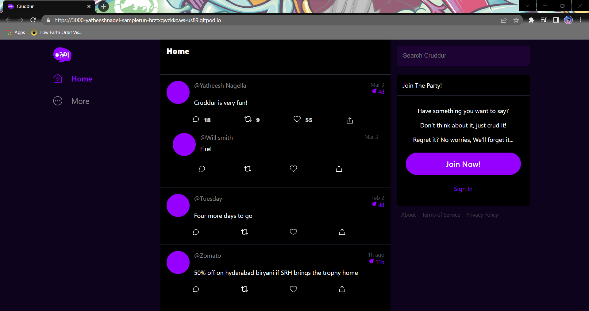

# FREE AWS Cloud Project Bootcamp

- Application: Cruddur
- Cohort: 2023-A1

This is the starting codebase that will be used in the FREE AWS Cloud Project Bootcamp 2023

## Journaling Homework

The `/journal` directory contains

- [ ] [Week 0](Journal/week00.md)
- [ ] [Week 1](Journal/week01.md)
- [ ] [Week 2](Journal/week02.md)
- [ ] [Week 3](Journall/week03.md)
- [ ] [Week 4](Journal/week04.md)
- [ ] [Week 5](Journal/week05.md)
- [ ] [Week 6](Journal/week06.md)
- [ ] [Week 7](Journal/week07.md)
- [ ] [Week 8](Journal/week08.md)
- [ ] [Week 9](Journal/week09.md)
- [ ] [Week 10](Journal/week10.md)
- [ ] [Week 11](Journal/week11.md)
- [ ] [Week 12](Journal/week12.md)
- [ ] [Week 13](Journal/week13.md)
